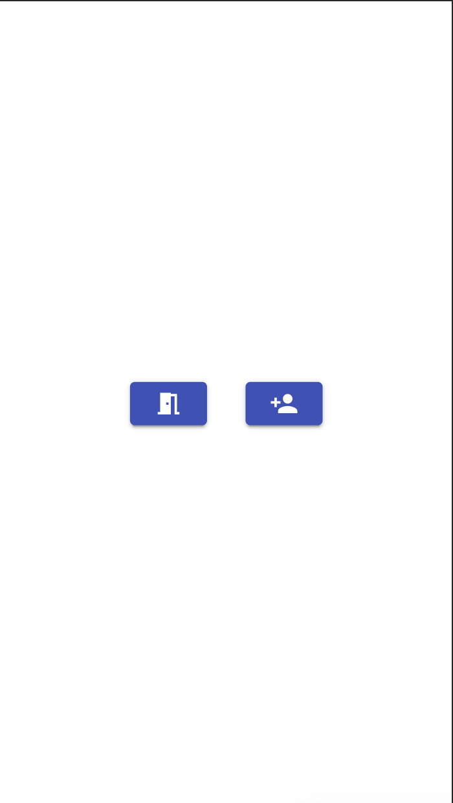
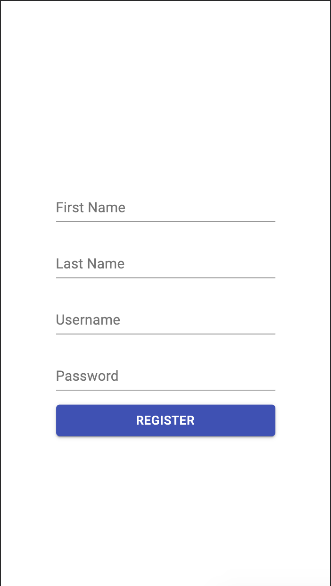
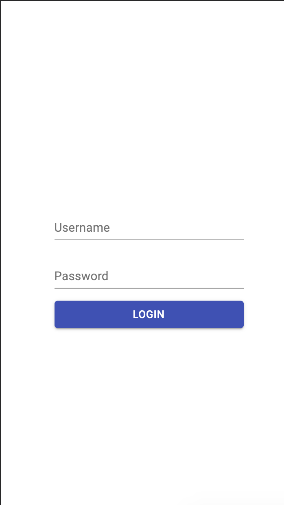
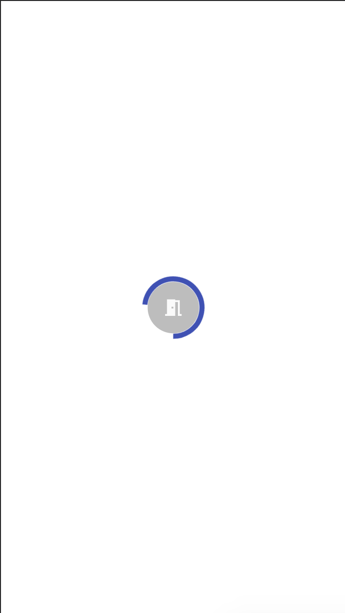
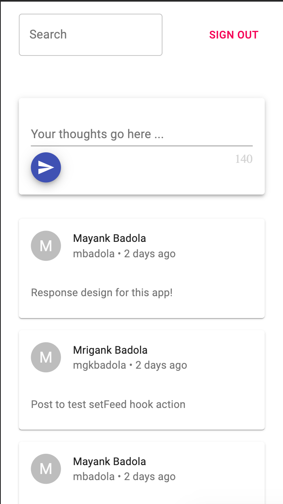
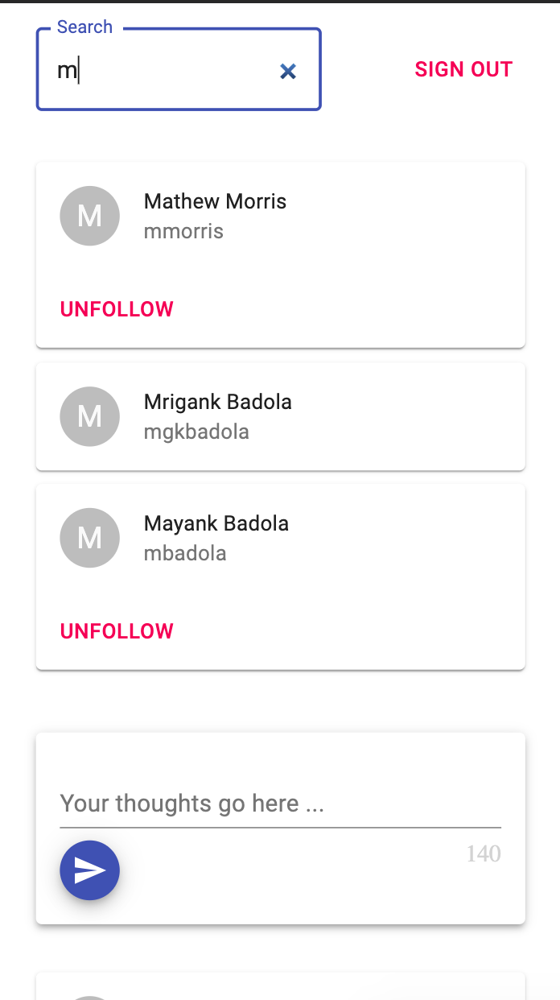

## Dependencies

* Node
* MongoDB

## Directions to Test

* Clone repository
* `cd` into the repository
* `npm install`
* `npm start`

## App Screenshots

<table>
  <tr>
    <td>Landing Page</td>
    <td>Registration Page</td>
    <td>Login Page</td>
  </tr>
  <tr>
    <td></td>
    <td></td>
    <td></td>
  </tr>
  <tr>
    <td>Re-Auth Page</td>
    <td>Feed View</td>
    <td>Profile Search</td>
  </tr>
  <tr>
    <td></td>
    <td></td>
    <td></td>
  </tr>
</table>
